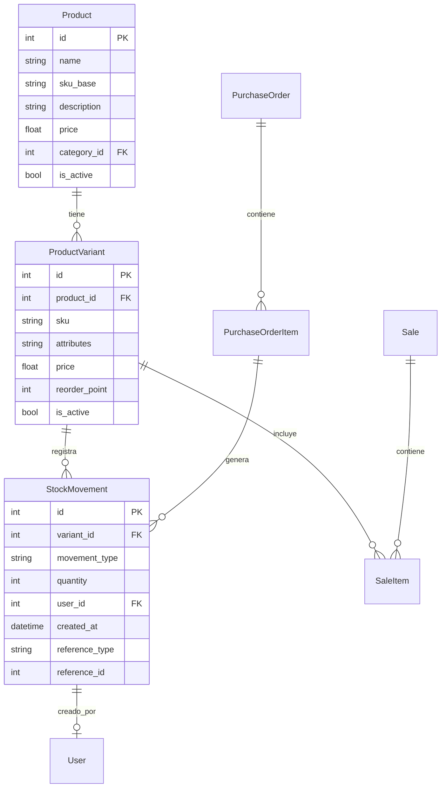

# StockSync — Sistema de Gestión de Inventario

Sistema de gestión de inventario para comercios de indumentaria. Resuelve el descontrol operativo causado por la gestión manual o descentralizada del stock mediante un modelo de **Producto Padre / SKU Hijo**, un **Kardex transaccional inmutable** y un módulo de **ventas con validación atómica** que previene saldos negativos bajo concurrencia.

Trabajo de campo integrador de **Ingeniería de Software II — IUA 2026**.

**Grupo 5:** Alasino Benjamin · Calvo Tomás · Contreras Joaquín · González Martín

---

## Stack Tecnológico

| Capa | Tecnología | Versión |
|---|---|---|
| Backend | Python + FastAPI | 3.12 / 0.115 |
| Frontend | TypeScript + React 18 + Vite | 5.6 / 18.3 / 5.4 |
| Base de datos | PostgreSQL | 16 |
| ORM / Migraciones | SQLAlchemy + Alembic | 2.0 / 1.14 |
| Validación | Pydantic | 2.10 |
| Autenticación | JWT (python-jose + passlib/bcrypt) | — |
| Contenedores | Docker + Docker Compose | — |

### Dependencias — Backend (`requirements.txt`)

| Paquete | Versión | Propósito |
|---|---|---|
| `fastapi` | 0.115.5 | Framework web |
| `uvicorn[standard]` | 0.32.1 | Servidor ASGI |
| `sqlalchemy` | 2.0.36 | ORM |
| `psycopg2-binary` | 2.9.10 | Driver PostgreSQL |
| `alembic` | 1.14.0 | Migraciones de BD |
| `pydantic` / `pydantic-settings` | 2.10.3 | Validación + configuración |
| `python-jose[cryptography]` | 3.3.0 | JWT |
| `passlib[bcrypt]` / `bcrypt` | 1.7.4 / 4.0.1 | Hashing de contraseñas |
| `python-multipart` | 0.0.17 | Soporte form-data |

### Dependencias — Frontend (`package.json`)

| Paquete | Versión | Propósito |
|---|---|---|
| `react` / `react-dom` | ^18.3.1 | UI |
| `react-router-dom` | ^6.27.0 | Enrutamiento |
| `axios` | ^1.7.7 | Cliente HTTP |
| `@tanstack/react-query` | ^5.59.20 | Cache y estado asíncrono |
| `react-hot-toast` | ^2.4.1 | Notificaciones |
| `vite` | ^5.4.11 | Bundler / dev server |
| `typescript` | ^5.6.3 | Tipado estático |

---

## Decisiones de Diseño

### Producto Padre / SKU Hijo (REQ-F01)

`Product` es el producto genérico (ej: "Remera Básica", SKU base "REM-BASE"). `ProductVariant` es el SKU específico generado automáticamente combinando atributos mediante producto cartesiano (`itertools.product`). Ej: "REM-BASE-M-ROJO". Esto evita crear cientos de SKUs manualmente.

### Kardex Inmutable (REQ-F02)

`StockMovement` es **append-only**. Nunca se hace UPDATE ni DELETE sobre esta tabla. El stock actual se calcula siempre como `SUM(quantity)` de todos los movimientos de una variante. `quantity` positivo = ingreso, negativo = egreso. Tipos: PURCHASE, SALE, ADJUSTMENT_IN, ADJUSTMENT_OUT, RETURN_IN, RETURN_OUT.

### Validación Atómica de Ventas (REQ-F03 + REQ-NF01)

Las ventas usan `SELECT FOR UPDATE` para bloquear la fila de la variante y prevenir race conditions. Si el stock es insuficiente, se hace rollback y se devuelve HTTP 409. Implementado en `stock_service.create_sale()`.

### RBAC (REQ-F05)

Roles: `admin` y `operator`. Las dependencias `get_current_user` y `require_admin` en `security.py` protegen los endpoints. Operaciones restringidas a Admin: crear/editar/eliminar productos, ajustar stock, gestionar usuarios, confirmar recepciones.

### Alertas de Punto de Reorden (REQ-F04)

Cada `ProductVariant` tiene un campo `reorder_point`. El endpoint `GET /stock/alerts/low-stock` devuelve variantes donde `stock_actual <= reorder_point`.

### Eliminación Lógica

Nunca se hace DELETE físico. Todos los registros se marcan con `is_active = False`.

---

## Arquitectura del Proyecto

```
StockSync/
├── backend/
│   ├── app/
│   │   ├── core/           # config.py, database.py, security.py
│   │   ├── models/         # SQLAlchemy: user, product, stock, supplier
│   │   ├── schemas/        # Pydantic: auth, user, product, stock
│   │   ├── services/       # Lógica de negocio: auth, product, stock
│   │   └── api/v1/         # Routers: auth, users, products, stock
│   ├── alembic/            # Migraciones de BD
│   ├── tests/              # pytest (48 tests)
│   ├── .coverage           # Reporte de cobertura
│   ├── requirements.txt
│   └── Dockerfile
├── frontend/
│   ├── src/
│   │   ├── types/          # Tipos TypeScript (index.ts)
│   │   ├── services/       # api.ts — cliente Axios
│   │   ├── pages/          # Dashboard, Login, Products, Stock, Reports
│   │   └── components/     # Componentes reutilizables
│   ├── index.html
│   └── Dockerfile
├── metricas/               # LOC, CC, MI, cobertura, defectos/KLOC
│   ├── loc_final.txt
│   ├── cc_final.txt
│   ├── mi_final.txt
│   ├── cobertura_final.txt
│   ├── defectos_final.txt
│   └── resumen_final.txt
├── docker-compose.yml
├── CLAUDE.md               # Contexto del proyecto para asistentes IA
└── README.md
```

---

## Instalación y Uso

### Con Docker (recomendado)

```bash
git clone https://github.com/benjaalasino/StockSync.git
cd StockSync
docker compose up --build
```

Las migraciones se ejecutan automáticamente al iniciar el backend.

| Servicio | URL |
|---|---|
| API (Swagger UI) | http://localhost:8000/docs |
| API (ReDoc) | http://localhost:8000/redoc |
| Frontend | http://localhost:5173 |
| PostgreSQL | localhost:5432 |

### Sin Docker — Backend

```bash
cd backend
python -m venv .venv
source .venv/bin/activate     # Linux/Mac
pip install -r requirements.txt
cp .env.example .env          # Editar DATABASE_URL
alembic upgrade head
uvicorn app.main:app --reload
```

### Sin Docker — Frontend

```bash
cd frontend
npm install
npm run dev
```

### Ejecutar Tests

```bash
cd backend
source .venv/bin/activate
pytest                          # 48 tests
pytest --cov=app --cov-report=term   # con cobertura
```

### Configuración de Entorno

Variables de entorno (`.env`):

| Variable | Default | Descripción |
|---|---|---|
| `DATABASE_URL` | `postgresql://stocksync:stocksync@db:5432/stocksync` | Conexión a BD |
| `SECRET_KEY` | `dev-secret-key-change-in-production` | Clave para firmar JWT |
| `DEBUG` | `false` | Modo debug |
| `CORS_ORIGINS` | `http://localhost:5173,http://localhost:3000` | Orígenes CORS |

---

## API — Endpoints

### Autenticación

| Método | Ruta | Descripción |
|---|---|---|
| POST | `/api/v1/auth/login` | Login → JWT |
| GET | `/api/v1/auth/me` | Perfil del usuario autenticado |

### Usuarios

| Método | Ruta | Descripción | Rol |
|---|---|---|---|
| GET | `/api/v1/users/` | Listar usuarios | Admin |
| POST | `/api/v1/users/` | Crear usuario | Admin |

### Productos

| Método | Ruta | Descripción |
|---|---|---|
| GET | `/api/v1/products/` | Listar productos con stock |
| POST | `/api/v1/products/` | Crear producto padre |
| GET | `/api/v1/products/{id}` | Obtener producto con variantes |
| PUT | `/api/v1/products/{id}` | Actualizar producto |
| DELETE | `/api/v1/products/{id}` | Eliminación lógica |
| POST | `/api/v1/products/{id}/variants` | Agregar variante manual |
| POST | `/api/v1/products/{id}/variants/generate` | Generar matriz de variantes |
| PUT | `/api/v1/products/{id}/variants/{variant_id}` | Actualizar variante |
| GET | `/api/v1/categories/` | Listar categorías |
| POST | `/api/v1/categories/` | Crear categoría |
| GET | `/api/v1/attribute-types/` | Listar tipos de atributo |
| POST | `/api/v1/attribute-types/` | Crear tipo de atributo |
| POST | `/api/v1/attribute-values/` | Crear valor de atributo |

### Stock y Kardex

| Método | Ruta | Descripción |
|---|---|---|
| GET | `/api/v1/stock/summary/{variant_id}` | Stock actual de una variante |
| GET | `/api/v1/stock/movements/{variant_id}` | Historial Kardex |
| GET | `/api/v1/stock/alerts/low-stock` | Alertas de punto de reorden |
| POST | `/api/v1/stock/adjust` | Ajuste manual (Admin) |

### Ventas y Compras

| Método | Ruta | Descripción |
|---|---|---|
| POST | `/api/v1/stock/sales` | Registrar venta |
| POST | `/api/v1/stock/purchases` | Crear orden de compra |
| POST | `/api/v1/stock/purchases/{id}/receive` | Confirmar recepción (Admin) |
| GET | `/api/v1/suppliers/` | Listar proveedores |
| POST | `/api/v1/suppliers/` | Crear proveedor |

---

## RBAC — Roles y Permisos

| Operación | Admin | Operador |
|---|---|---|
| Ver productos y stock | ✅ | ✅ |
| Registrar ventas | ✅ | ✅ |
| Crear órdenes de compra | ✅ | ✅ |
| Ver alertas de stock | ✅ | ✅ |
| Crear/editar productos | ✅ | ❌ |
| Ajustar stock manualmente | ✅ | ❌ |
| Gestionar usuarios | ✅ | ❌ |
| Confirmar recepción de compras | ✅ | ❌ |

---

## Modelo de Datos



---

## Calidad del Software

Todas las métricas están dentro de los umbrales definidos en el Plan SQA.

| Métrica | Valor | Umbral | Estado |
|---|---|---|---|
| LOC (backend) | 1.777 | — | — |
| LOC (tests) | 1.180 | — | — |
| LOC (frontend) | 808 | — | — |
| CC promedio | 1.47 | ≤ 10 | ✅ |
| CC máxima | 5 | ≤ 10 | ✅ |
| MI mínimo | 55.21 | ≥ 40 | ✅ |
| Cobertura | 91.37% | ≥ 80% | ✅ |
| Defectos/KLOC | 1.16 | < 2 | ✅ |
| Tests | 48 (100% pasan) | — | ✅ |

Ver reportes detallados en `metricas/`.

---

## Hitos del Trabajo de Campo

| # | Fecha | Entregable | Estado |
|---|---|---|---|
| 1 | 29/04 | Conformación de grupos + idea | ✅ |
| 2 | 05/05 | Propuesta de proyecto (PDF) | ✅ |
| 3 | 20/05 | Plan SQA + métricas (LOC, CC, MI) + linter | ✅ |
| 4 | 03/06 | Plan de pruebas + casos + cobertura ≥ 60% | ✅ |
| 5 | 16/06 | Entrega final + RTM + wireframes + defensa oral | ✅ |

---

## Enlaces

- **Repositorio:** https://github.com/benjaalasino/StockSync
- **Swagger UI:** http://localhost:8000/docs
- **Frontend:** http://localhost:5173
